# FactorioModTranslator 設計資料

## 1. システム概要

Factorio 2.x (Space Age) 対応Modの翻訳ファイル(.cfg)を自動翻訳・管理するWindows GUIアプリケーション。

| 項目 | 内容 |
|---|---|
| アプリ名 | FactorioModTranslator |
| 対象OS | Windows 10/11 |
| フレームワーク | .NET 8 / WPF |
| アーキテクチャ | MVVM (Model-View-ViewModel) |
| 翻訳エンジン | DeepL API / Google Translate API |
| データ永続化 | SQLite (履歴) / JSON (設定・用語集) |
| 配布形態 | self-contained exe (ZIP) |
| ライセンス | MIT |

---

## 2. ユースケース図

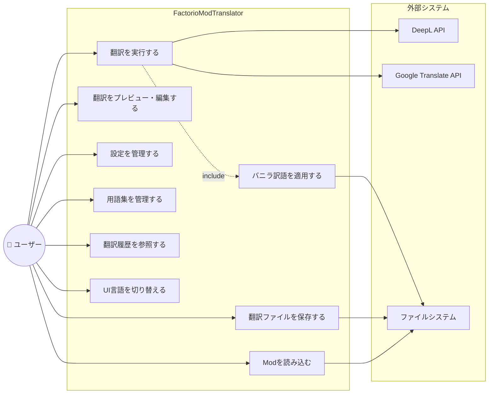

### ユースケース一覧

| ID | ユースケース | 概要 | アクター |
|---|---|---|---|
| UC1 | Modを読み込む | ローカルフォルダまたはZIPファイルからModを読み込み、locale内のcfgファイルを解析 | ユーザー |
| UC2 | 翻訳を実行する | 選択した翻訳モード（新規/差分/上書き）で翻訳APIを呼び出し | ユーザー, 翻訳API |
| UC3 | 翻訳をプレビュー・編集する | 翻訳結果を表示し、手動で修正可能 | ユーザー |
| UC4 | 翻訳ファイルを保存する | cfgファイルとしてlocale構造でエクスポート | ユーザー |
| UC5 | 設定を管理する | APIキー、翻訳エンジン選択、Factorioパスを設定 | ユーザー |
| UC6 | 用語集を管理する | 固有名詞と固定訳の登録・編集・削除 | ユーザー |
| UC7 | 翻訳履歴を参照する | 過去の翻訳結果の閲覧、差分更新への再利用 | ユーザー |
| UC8 | バニラ訳語を適用する | Factorio公式訳語とマッチングし適用 | (UC2から呼出) |
| UC9 | UI言語を切り替える | 日本語/英語の表示切替 | ユーザー |

### ユースケース記述

#### UC1: Modを読み込む

| 項目 | 内容 |
|---|---|
| ユースケースID | UC1 |
| ユースケース名 | Modを読み込む |
| アクター | ユーザー |
| 概要 | ローカルフォルダまたはZIPファイルからModを読み込み、locale内のcfgファイルを解析してアプリ内に取り込む |
| 事前条件 | アプリケーションが起動済みであること |
| 事後条件 | Modの情報（名前、バージョン等）とlocaleファイルの内容が画面に表示され、翻訳対象として選択可能な状態になる |
| トリガー | ユーザーがフォルダ選択ボタンまたはZIPファイル選択ボタンを押下する |

**基本フロー:**

| # | アクター | システム |
|---|---|---|
| 1 | フォルダ選択ボタンまたはZIPファイル選択ボタンを押下する | |
| 2 | | ファイル/フォルダ選択ダイアログを表示する |
| 3 | フォルダまたはZIPファイルを選択する | |
| 4 | | ModLoader がModの `info.json` を解析し、Mod名・バージョン・著者等の情報を取得する |
| 5 | | locale ディレクトリ配下の `.cfg` ファイルを収集する |
| 6 | | CfgParser が各 `.cfg` ファイルを解析し、セクション・キー・値を抽出する |
| 7 | | 読み込んだModの情報と利用可能な言語一覧を画面に表示する |

**代替フロー:**

| # | 条件 | 処理 |
|---|---|---|
| 4a | `info.json` が存在しないまたは不正 | エラーメッセージ「Modの情報ファイルが見つかりません」を表示し、Mod未選択状態に戻る |
| 5a | locale ディレクトリが存在しない | エラーメッセージ「翻訳対象のlocaleフォルダが見つかりません」を表示し、Mod未選択状態に戻る |
| 6a | `.cfg` ファイルの解析に失敗 | エラーメッセージ「cfgファイルの解析に失敗しました: {詳細}」を表示する。解析可能なファイルのみ読み込みを継続する |
| 3a | ZIPファイルが破損または展開不可 | エラーメッセージ「ZIPファイルを展開できません」を表示し、Mod未選択状態に戻る |

---

#### UC2: 翻訳を実行する

| 項目 | 内容 |
|---|---|
| ユースケースID | UC2 |
| ユースケース名 | 翻訳を実行する |
| アクター | ユーザー, 翻訳API (DeepL / Google Translate) |
| 概要 | 選択した翻訳モード（新規/差分/上書き）で翻訳エンジンを呼び出し、Modの翻訳を実行する |
| 事前条件 | UC1 でModが読み込まれていること。設定画面で翻訳エンジンのAPIキーが登録済みであること |
| 事後条件 | 翻訳結果がTranslationItemのリストとしてプレビュー画面に表示され、各エントリの翻訳ソース（バニラ/API/用語集/履歴）が記録されていること。翻訳履歴がSQLiteに保存されていること |
| トリガー | ユーザーが翻訳モード・ソース言語・ターゲット言語を選択し、翻訳実行ボタンを押下する |
| インクルード | UC8（バニラ訳語を適用する） |

**基本フロー:**

| # | アクター | システム |
|---|---|---|
| 1 | 翻訳モード（新規/差分/上書き）を選択する | |
| 2 | ソース言語とターゲット言語を選択する | |
| 3 | 翻訳実行ボタンを押下する | |
| 4 | | TranslationOrchestrator が翻訳モードに応じた対象エントリを決定する |
| 5 | | 各エントリに対して以下の優先順で翻訳を試みる: |
| 5a | | ① 用語集（GlossaryService）で完全一致をチェック |
| 5b | | ② バニラ訳語のキーマッチ（VanillaTranslationService.MatchByKey）をチェック【UC8】 |
| 5c | | ③ バニラ訳語のテキストマッチ（VanillaTranslationService.MatchByText）をチェック【UC8】 |
| 5d | | ④ 翻訳履歴（TranslationHistoryService）から過去の翻訳を検索 |
| 5e | | ⑤ 上記すべてマッチしない場合、用語集適用済みテキストとバニラ参考訳語を付加して翻訳APIに送信 |
| 6 | | 翻訳結果をTranslationItemとして生成し、翻訳ソース（Source）を設定する |
| 7 | | 各翻訳結果をSQLite（translation_history）に保存する |
| 8 | | 進捗バーを更新しながら処理を進め、完了後プレビュータブに自動遷移する |

**代替フロー:**

| # | 条件 | 処理 |
|---|---|---|
| 4a | APIキーが未設定 | エラーメッセージ「APIキーが設定されていません。設定画面で登録してください」を表示し中断する |
| 5e-a | API呼び出しがタイムアウト | 最大3回リトライする。3回失敗した場合、該当エントリをスキップしエラーログに記録する |
| 5e-b | APIレート制限に到達 | 一定時間待機後にリトライする。ユーザーに待機中であることを通知する |
| 5e-c | APIキーが無効 | エラーメッセージ「APIキーが無効です」を表示し翻訳を中断する |
| 3a | ユーザーがキャンセルボタンを押下 | 翻訳処理を中断し、それまでに完了した翻訳結果をプレビューに表示する |

---

#### UC3: 翻訳をプレビュー・編集する

| 項目 | 内容 |
|---|---|
| ユースケースID | UC3 |
| ユースケース名 | 翻訳をプレビュー・編集する |
| アクター | ユーザー |
| 概要 | 翻訳結果を一覧表示し、ユーザーが手動で翻訳テキストを修正できる |
| 事前条件 | UC2 の翻訳実行が完了し、翻訳結果が存在すること |
| 事後条件 | ユーザーの編集内容がTranslationItemに反映され、IsEdited=true、Source=Manualに更新されていること |
| トリガー | 翻訳完了後の自動遷移、またはユーザーがプレビュータブを選択する |

**基本フロー:**

| # | アクター | システム |
|---|---|---|
| 1 | | 翻訳結果一覧を表形式で表示する（セクション、キー、原文、翻訳文、翻訳ソース） |
| 2 | 必要に応じてフィルタテキストを入力する | |
| 3 | | フィルタ条件に一致するエントリのみを表示する |
| 4 | 翻訳テキストのセルをダブルクリックして編集する | |
| 5 | 修正した翻訳テキストを入力し確定する | |
| 6 | | TranslationItem の TranslatedText を更新し、IsEdited = true、Source = Manual に設定する |

**代替フロー:**

| # | 条件 | 処理 |
|---|---|---|
| 4a | ユーザーがリバートボタンを押下 | 編集前の翻訳テキストに戻し、IsEdited = false、Source を元の値に復元する |

---

#### UC4: 翻訳ファイルを保存する

| 項目 | 内容 |
|---|---|
| ユースケースID | UC4 |
| ユースケース名 | 翻訳ファイルを保存する |
| アクター | ユーザー |
| 概要 | プレビュー画面の翻訳結果を `.cfg` ファイルとして locale 構造でエクスポートする |
| 事前条件 | UC3 でプレビュー画面に翻訳結果が表示されていること |
| 事後条件 | `locale/{lang}/*.cfg` のフォーマットで翻訳済みファイルが保存されていること |
| トリガー | ユーザーが保存ボタンを押下する |

**基本フロー:**

| # | アクター | システム |
|---|---|---|
| 1 | 保存ボタンを押下する | |
| 2 | | 保存先フォルダ選択ダイアログを表示する |
| 3 | 保存先フォルダを選択する | |
| 4 | | TranslationItem のリストを CfgFile オブジェクトに変換する |
| 5 | | CfgParser が CfgFile を `.cfg` フォーマットで書き出す。セクション順序とコメントを保持する |
| 6 | | `locale/{targetLang}/` ディレクトリ構造でファイルを出力する |
| 7 | | 保存完了通知を表示する |

**代替フロー:**

| # | 条件 | 処理 |
|---|---|---|
| 6a | 書込権限がない | エラーメッセージ「ファイルの保存に失敗しました: 書込権限がありません」を表示する |
| 6b | ディスク容量不足 | エラーメッセージ「ディスク容量が不足しています」を表示する |

---

#### UC5: 設定を管理する

| 項目 | 内容 |
|---|---|
| ユースケースID | UC5 |
| ユースケース名 | 設定を管理する |
| アクター | ユーザー |
| 概要 | APIキー、翻訳エンジン選択、Factorioインストールパスなどのアプリケーション設定を行う |
| 事前条件 | アプリケーションが起動済みであること |
| 事後条件 | 設定が `appsettings.json` に保存され、APIキーがDPAPIで暗号化保存されていること |
| トリガー | ユーザーが設定タブを選択する |

**基本フロー:**

| # | アクター | システム |
|---|---|---|
| 1 | 設定タブを選択する | |
| 2 | | 現在の設定値を読み込み画面に表示する |
| 3 | 翻訳エンジン（DeepL / Google Translate）を選択する | |
| 4 | 選択したエンジンのAPIキーを入力する | |
| 5 | テスト接続ボタンを押下する | |
| 6 | | 入力されたAPIキーでテスト翻訳（"test" を en→ja）を実行する |
| 7 | | テスト結果（成功/失敗）を表示する |
| 8 | Factorioのインストールパスを入力、または参照ボタンで選択する | |
| 9 | 保存ボタンを押下する | |
| 10 | | SettingsService がエンジン選択・パスを `appsettings.json` に保存する |
| 11 | | APIキーをDPAPIで暗号化し保存する |
| 12 | | 保存完了通知を表示する |

**代替フロー:**

| # | 条件 | 処理 |
|---|---|---|
| 6a | テスト接続失敗 | エラーメッセージ「接続失敗: {エラー詳細}」を表示する。保存は可能だが警告を示す |
| 8a | Factorioパスが無効 | 「指定されたパスにFactorioが見つかりません」と警告を表示する |

---

#### UC6: 用語集を管理する

| 項目 | 内容 |
|---|---|
| ユースケースID | UC6 |
| ユースケース名 | 用語集を管理する |
| アクター | ユーザー |
| 概要 | 翻訳時に使用する固有名詞と固定訳語の登録・編集・削除を行う |
| 事前条件 | アプリケーションが起動済みであること |
| 事後条件 | 用語集が `glossary.json` に保存され、次回の翻訳時に適用されること |
| トリガー | ユーザーが用語集タブを選択する |

**基本フロー（用語追加）:**

| # | アクター | システム |
|---|---|---|
| 1 | 用語集タブを選択する | |
| 2 | | 現在の用語一覧を `glossary.json` から読み込み表示する |
| 3 | 原語（SourceTerm）と訳語（TargetTerm）を入力する | |
| 4 | ソース言語・ターゲット言語を選択する | |
| 5 | 必要に応じて「翻訳対象から除外」チェックを設定する | |
| 6 | 追加ボタンを押下する | |
| 7 | | GlossaryService が新しいエントリを用語集に追加し、`glossary.json` に保存する |

**基本フロー（用語編集）:**

| # | アクター | システム |
|---|---|---|
| 1 | 一覧から編集対象の用語を選択する | |
| 2 | 訳語等を修正する | |
| 3 | 編集ボタンを押下する | |
| 4 | | 修正内容を反映し `glossary.json` に保存する |

**基本フロー（用語削除）:**

| # | アクター | システム |
|---|---|---|
| 1 | 一覧から削除対象の用語を選択する | |
| 2 | 削除ボタンを押下する | |
| 3 | | 確認ダイアログを表示する |
| 4 | 確認する | |
| 5 | | 用語を削除し `glossary.json` に保存する |

**代替フロー:**

| # | 条件 | 処理 |
|---|---|---|
| 6a | 同一の原語が既に登録済み | 「この原語は既に登録されています。上書きしますか？」と確認ダイアログを表示する |
| - | インポートボタン押下 | 外部の用語集ファイル（JSON/CSV）を読み込み、既存の用語集にマージする |
| - | エクスポートボタン押下 | 現在の用語集をJSON/CSVファイルとしてエクスポートする |

---

#### UC7: 翻訳履歴を参照する

| 項目 | 内容 |
|---|---|
| ユースケースID | UC7 |
| ユースケース名 | 翻訳履歴を参照する |
| アクター | ユーザー |
| 概要 | 過去に実行した翻訳の結果をSQLiteから検索・閲覧し、差分更新時の再利用に活用する |
| 事前条件 | アプリケーションが起動済みであること。過去に翻訳が実行されていること（履歴が存在すること） |
| 事後条件 | なし（参照のみ） |
| トリガー | ユーザーが履歴タブを選択する |

**基本フロー:**

| # | アクター | システム |
|---|---|---|
| 1 | 履歴タブを選択する | |
| 2 | | TranslationHistoryService がSQLite（translation_history テーブル）から履歴一覧を読み込み表示する |
| 3 | Mod名、キー、翻訳日時等で検索・フィルタを行う | |
| 4 | | 条件に一致する履歴を表示する |
| 5 | 特定の履歴エントリを選択して詳細を確認する | |
| 6 | | 選択したエントリの原文、翻訳文、使用エンジン、翻訳日時等の詳細を表示する |

**代替フロー:**

| # | 条件 | 処理 |
|---|---|---|
| 2a | 履歴データが存在しない | 「翻訳履歴はありません」と表示する |
| 2b | SQLiteデータベースが破損 | エラーメッセージを表示し、データベース再作成を提案する |

---

#### UC8: バニラ訳語を適用する

| 項目 | 内容 |
|---|---|
| ユースケースID | UC8 |
| ユースケース名 | バニラ訳語を適用する |
| アクター | （UC2から自動呼出） |
| 概要 | Factorio公式（バニラ）の翻訳データとModの翻訳対象エントリを照合し、一致するものにバニラ訳語を適用する |
| 事前条件 | 設定画面でFactorioのインストールパスが設定済みであること。バニラの翻訳データ（locale内cfgファイル）が読み込み可能であること |
| 事後条件 | マッチしたエントリにバニラ訳語が適用され、TranslationSource が VanillaKeyMatch または VanillaTextMatch に設定されていること |
| トリガー | UC2（翻訳を実行する）の処理中に自動的に呼び出される |

**基本フロー:**

| # | システム処理 |
|---|---|
| 1 | VanillaTranslationService が Factorioインストールフォルダから対象言語のバニラ翻訳データを読み込む |
| 2 | 翻訳対象エントリのセクション+キーでバニラデータをキーマッチ検索する |
| 3 | キーマッチした場合、バニラ訳語を適用し Source = VanillaKeyMatch を設定する |
| 4 | キーマッチしなかった場合、原文テキストでバニラデータをテキストマッチ検索する |
| 5 | テキストマッチした場合、バニラ訳語を適用し Source = VanillaTextMatch を設定する |
| 6 | いずれもマッチしなかった場合、バニラ訳語の参考情報（類似テキストの訳語リスト）を取得し、翻訳APIへの入力に付加する |

**代替フロー:**

| # | 条件 | 処理 |
|---|---|---|
| 1a | Factorioインストールパスが未設定 | バニラ訳語マッチングをスキップし、直接翻訳APIに移行する |
| 1b | バニラ翻訳データの読み込みに失敗 | 警告ログを出力し、バニラ訳語マッチングをスキップする |

---

#### UC9: UI言語を切り替える

| 項目 | 内容 |
|---|---|
| ユースケースID | UC9 |
| ユースケース名 | UI言語を切り替える |
| アクター | ユーザー |
| 概要 | アプリケーションの表示言語を日本語/英語で切り替える |
| 事前条件 | アプリケーションが起動済みであること |
| 事後条件 | UIの全文字列が選択した言語で表示され、設定が `appsettings.json` に保存されていること |
| トリガー | ユーザーが言語切替ボタン/メニューを操作する |

**基本フロー:**

| # | アクター | システム |
|---|---|---|
| 1 | 言語切替ボタン/メニューで切替先の言語を選択する | |
| 2 | | LocalizationService.SetLanguage(lang) を呼び出す |
| 3 | | リソースファイルから選択言語の文字列リソースを読み込む |
| 4 | | LanguageChanged イベントを発火し、全画面のUI文字列を更新する |
| 5 | | 選択した言語を `appsettings.json` の `uiLanguage` に保存する |

**代替フロー:**

| # | 条件 | 処理 |
|---|---|---|
| 3a | 言語リソースファイルが見つからない | デフォルト言語（日本語）にフォールバックし、警告を表示する |

---

## 3. クラス図

### 3.1 全体構成


### 3.2 サービス層

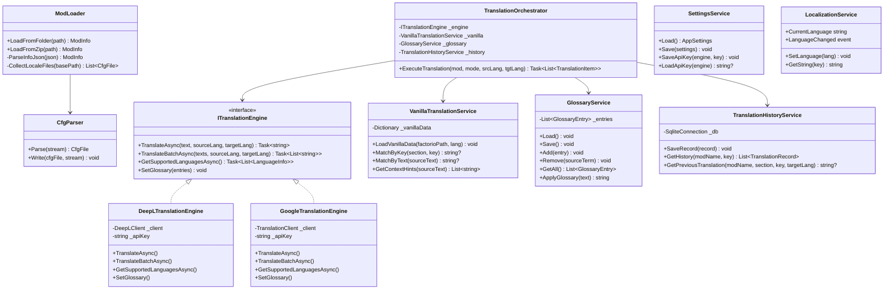

### 3.3 ViewModel層

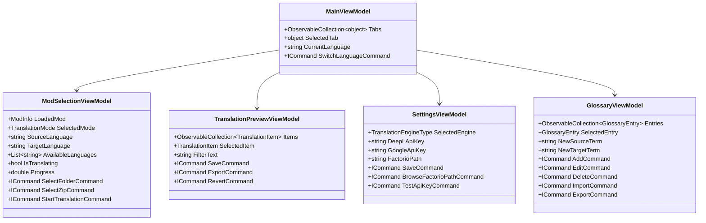

---

## 4. シーケンス図

### 4.1 Mod読み込み → 翻訳実行フロー

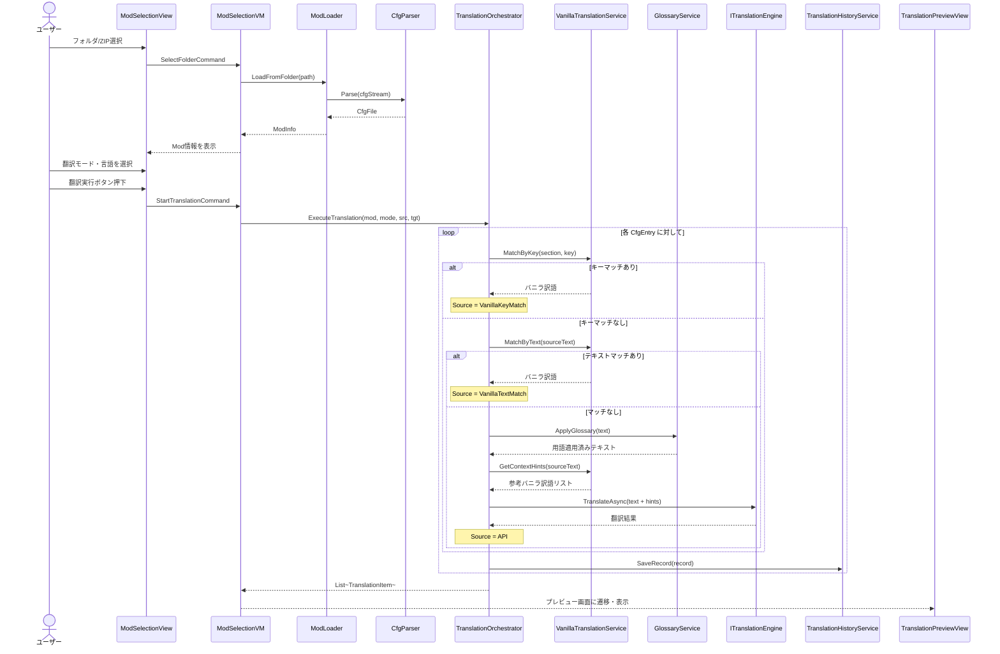

### 4.2 翻訳プレビュー → 保存フロー

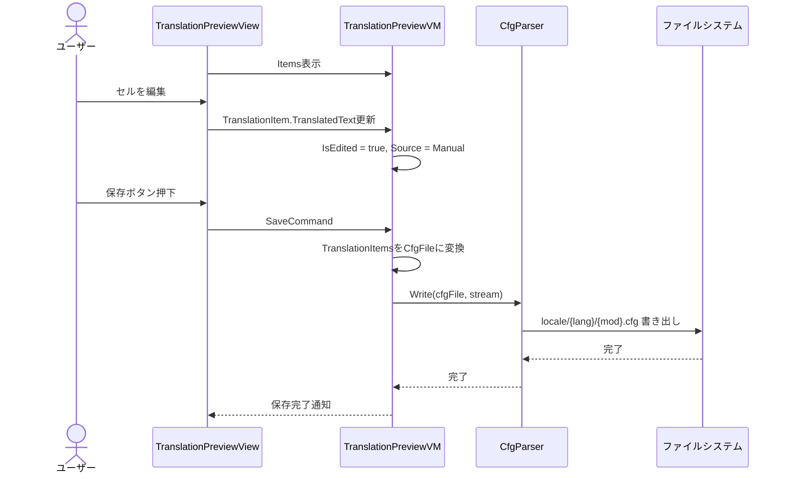

### 4.3 設定画面 - APIキー保存フロー

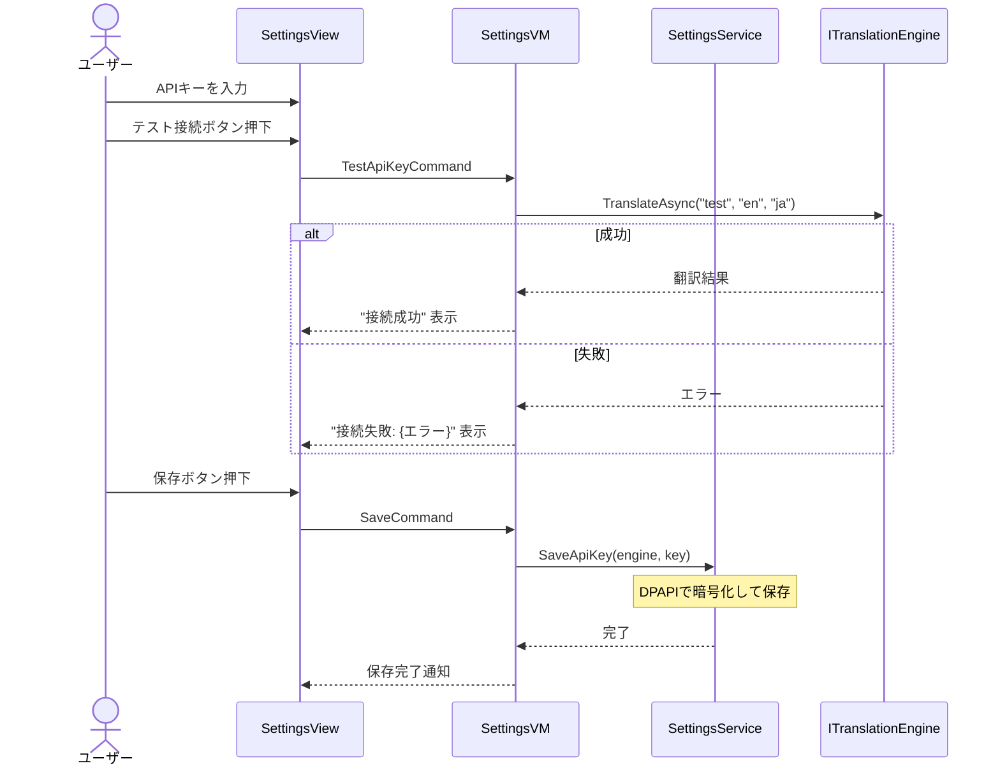

---

## 5. 状態遷移図

### 5.1 アプリケーション全体の状態遷移

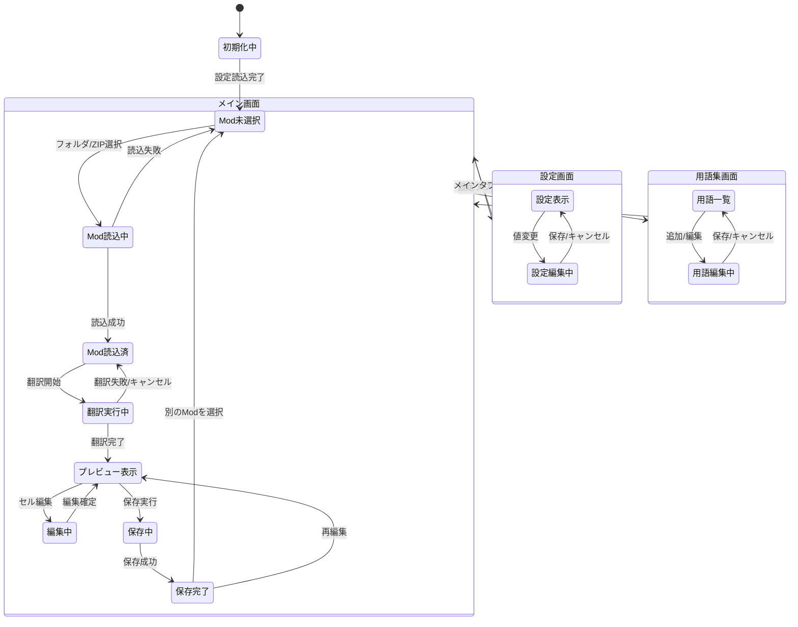

### 5.2 翻訳エントリの状態遷移

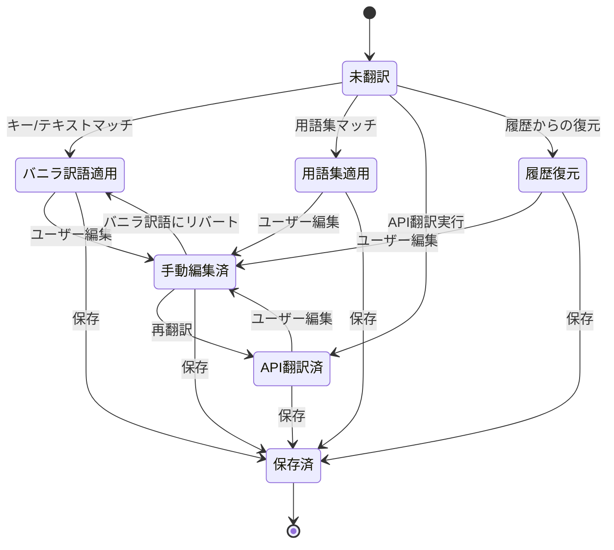

---

## 6. データフロー図

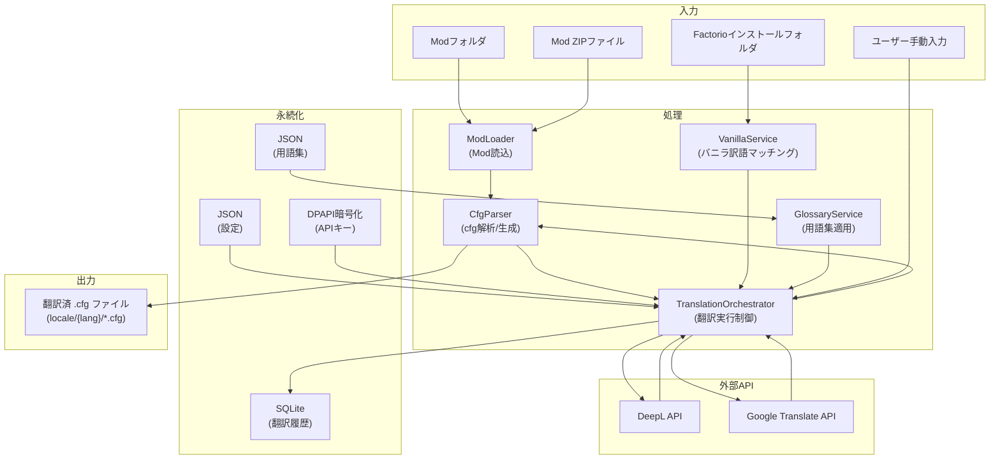

---

## 7. 画面構成

### 7.1 画面一覧

| 画面 | 概要 | 主要操作 |
|---|---|---|
| メインウィンドウ | TabControlベースの全体レイアウト | タブ切替、言語切替 |
| Mod選択タブ | Modの読込と翻訳実行 | フォルダ/ZIP選択、翻訳モード選択、翻訳実行 |
| プレビュータブ | 翻訳結果の確認・編集 | セル編集、フィルタ、保存 |
| 設定タブ | APIキーやパス等の設定 | APIキー入力、テスト接続、Factorioパス |
| 用語集タブ | 用語の登録・管理 | 追加、編集、削除、インポート/エクスポート |
| 履歴タブ | 翻訳履歴の参照 | 検索、フィルタ、再利用 |

### 7.2 画面遷移図

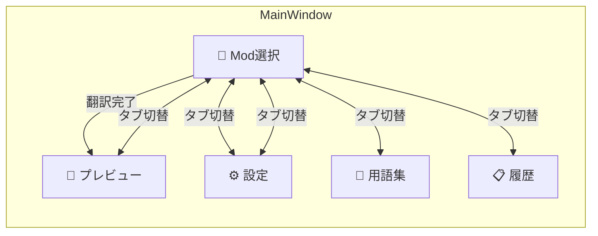

---

## 8. データ定義

### 8.1 .cfg ファイルフォーマット

```ini
; コメント行
[section-name]
key1=Value text
key2=Another value with __1__ placeholders
key3=Multi-word value

[another-section]
key-a=Some text
```

**解析ルール:**
- `;` で始まる行はコメント
- `[xxx]` はセクションヘッダー
- `key=value` は翻訳エントリ（`=` の左がキー、右が値）
- `__1__`, `__2__` はプレースホルダー（翻訳時に保持必須）
- 空行はそのまま保持

### 8.2 SQLite テーブル定義

```sql
CREATE TABLE translation_history (
    id              INTEGER PRIMARY KEY AUTOINCREMENT,
    mod_name        TEXT NOT NULL,
    mod_version     TEXT,
    section         TEXT NOT NULL,
    key             TEXT NOT NULL,
    source_lang     TEXT NOT NULL,
    target_lang     TEXT NOT NULL,
    source_text     TEXT NOT NULL,
    translated_text TEXT NOT NULL,
    engine          TEXT NOT NULL,
    translated_at   TEXT NOT NULL DEFAULT (datetime('now')),
    UNIQUE(mod_name, section, key, target_lang)
);

CREATE INDEX idx_history_mod ON translation_history(mod_name);
CREATE INDEX idx_history_key ON translation_history(section, key);
```

### 8.3 設定ファイル (appsettings.json)

```json
{
  "selectedEngine": "DeepL",
  "factorioInstallPath": "C:\\Program Files\\Factorio",
  "uiLanguage": "ja",
  "lastModPath": "",
  "windowWidth": 1200,
  "windowHeight": 800
}
```

### 8.4 用語集ファイル (glossary.json)

```json
[
  {
    "sourceTerm": "iron plate",
    "targetTerm": "鉄板",
    "sourceLang": "en",
    "targetLang": "ja",
    "excludeFromTranslation": false
  }
]
```

---

## 9. バニラ訳語マッチング アルゴリズム

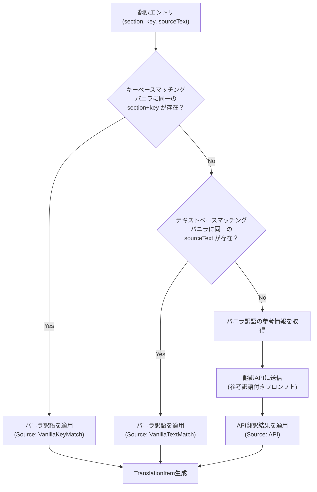

### 優先度テーブル

| 優先度 | ソース | 条件 | 上書き可否 |
|---|---|---|---|
| 1 | 用語集 (Glossary) | 完全一致する用語が登録済 | ユーザー編集可 |
| 2 | バニラ (キーマッチ) | section+keyがバニラと一致 | ユーザー編集可 |
| 3 | バニラ (テキストマッチ) | 英語原文がバニラと一致 | ユーザー編集可 |
| 4 | 翻訳履歴 | 過去に同キーの翻訳あり | ユーザー編集可 |
| 5 | 翻訳API | API呼び出し（バニラ参考付き） | ユーザー編集可 |

---

## 10. 翻訳モード別処理

| モード | 対象エントリ | 既存翻訳の扱い | 用途 |
|---|---|---|---|
| 新規翻訳 | ソース言語の全エントリ | 翻訳先localeが無い前提 | Modの初回翻訳 |
| 差分翻訳 | ターゲットに存在しないエントリのみ | 既存翻訳は保持 | Modアップデート後の追加分翻訳 |
| 上書き更新 | ソース言語の全エントリ | 既存翻訳を上書き | 全体の再翻訳 |
| 手動編集 | なし（API呼び出しなし） | プレビュー画面で直接編集 | 微調整 |

---

## 11. エラーハンドリング方針

| カテゴリ | エラー例 | 対処 |
|---|---|---|
| API | APIキー無効、レート制限 | ユーザーに通知、リトライ提案 |
| ファイル | cfg解析失敗、書込権限なし | 詳細エラーメッセージ表示 |
| ネットワーク | 接続タイムアウト | リトライ（最大3回）、フォールバック |
| データ | SQLite破損 | DB再作成を提案 |

---

## 12. 非機能要件

| 項目 | 要件 |
|---|---|
| パフォーマンス | 1000エントリの翻訳を5分以内（API応答時間依存） |
| 応答性 | 翻訳中もUIがフリーズしない（async/await） |
| セキュリティ | APIキーはDPAPIで暗号化保存 |
| 保守性 | MVVM+DI構成、インターフェース分離 |
| 拡張性 | 翻訳エンジンの追加が容易（ITranslationEngine実装追加のみ） |
| i18n | UI文字列はリソースファイルで管理 |
