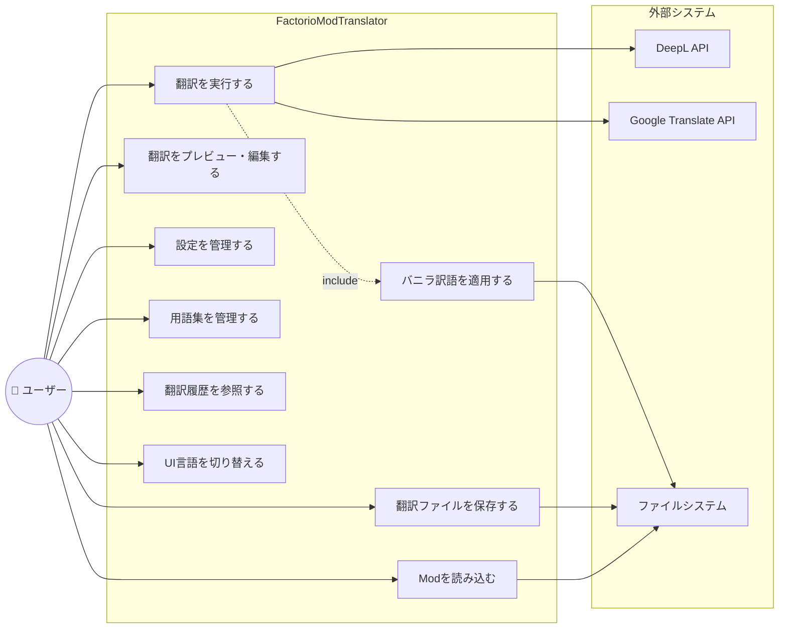
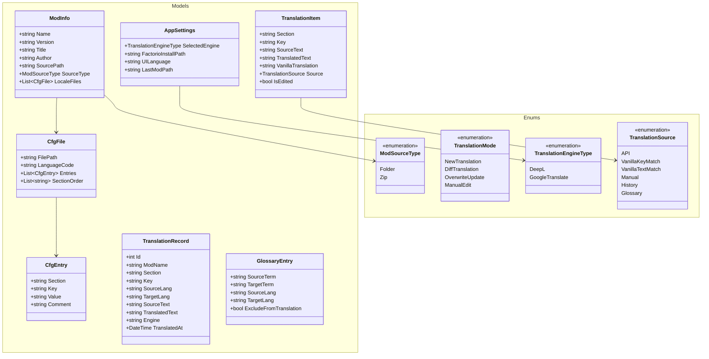
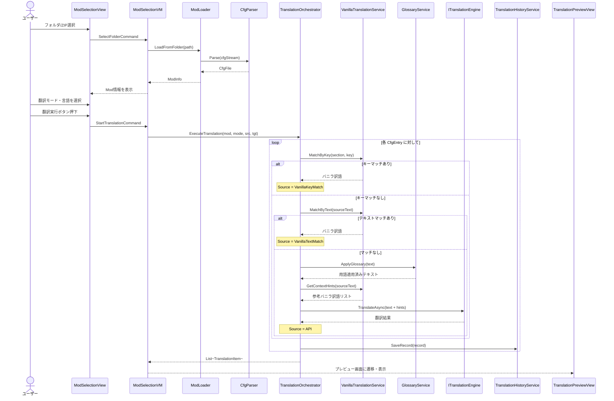
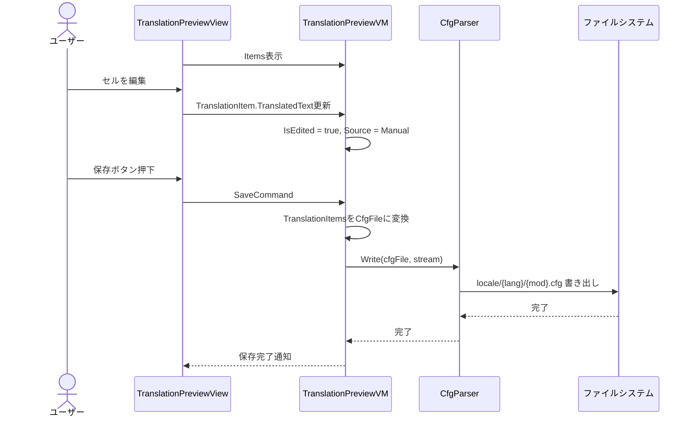
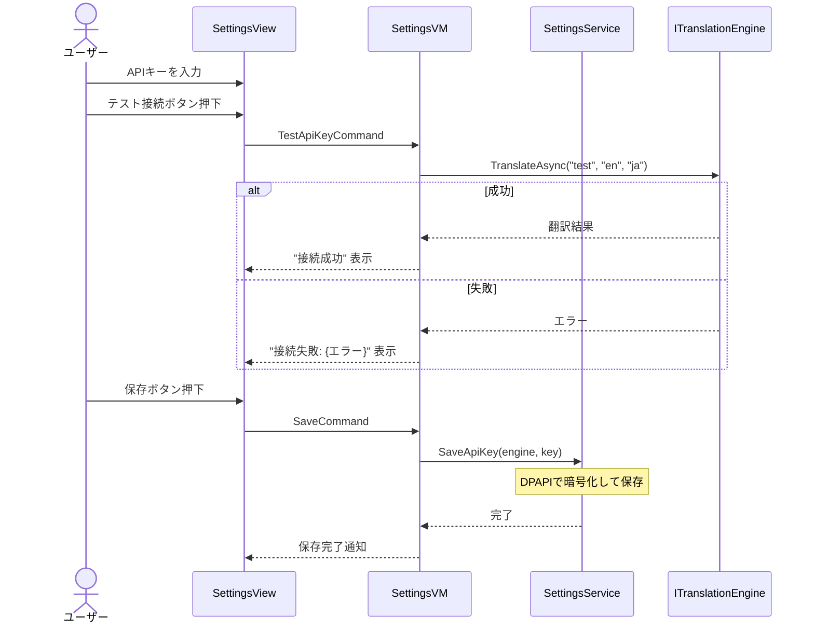
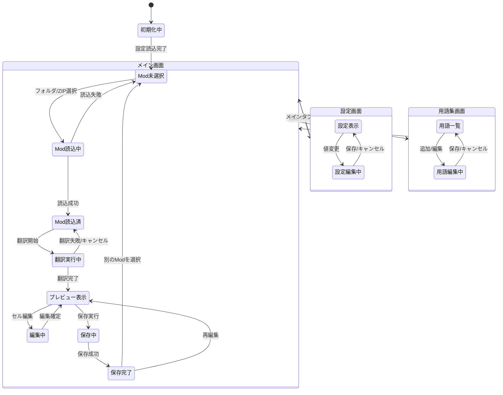
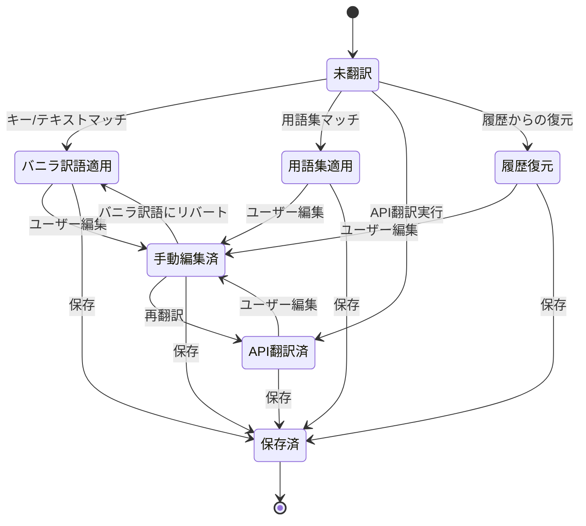
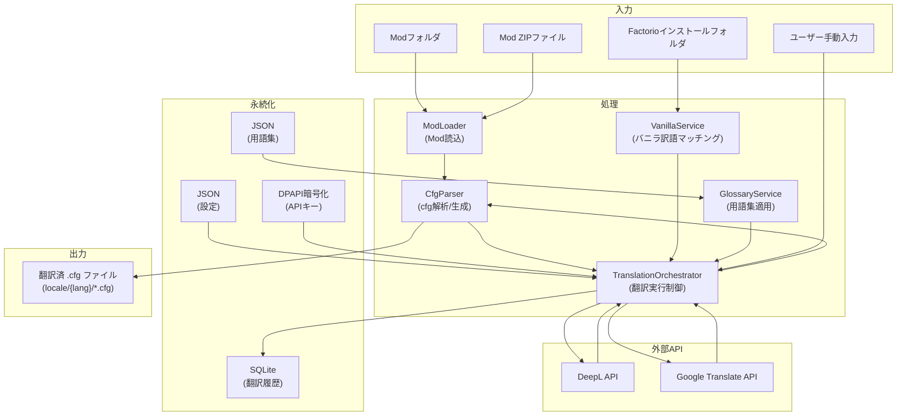
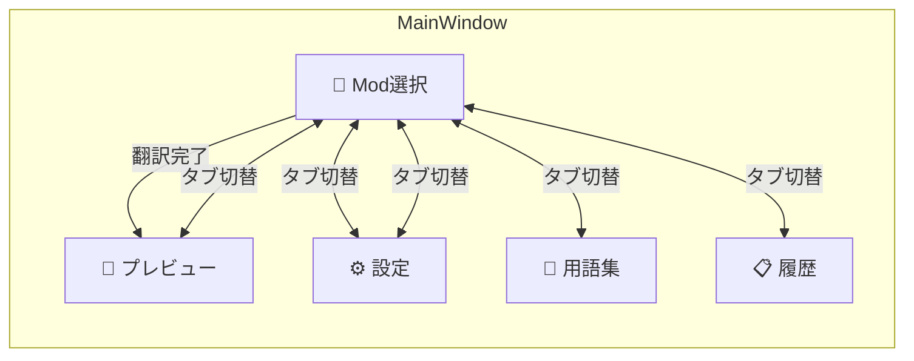
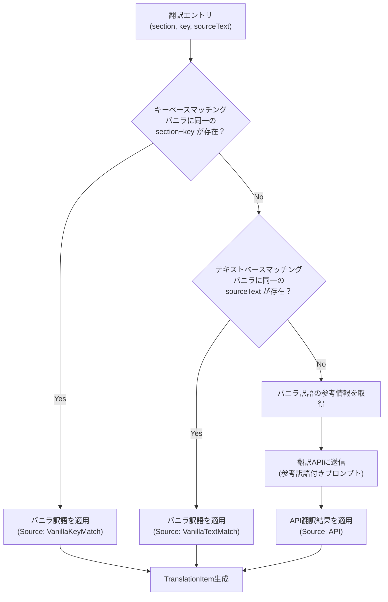

# FactorioModTranslator 設計資料

## 1. システム概要

Factorio 2.x (Space Age) 対応Modの翻訳ファイル(.cfg)を自動翻訳・管理するWindows GUIアプリケーション。

| 項目 | 内容 |
|---|---|
| アプリ名 | FactorioModTranslator |
| 対象OS | Windows 10/11 |
| フレームワーク | .NET 8 / WPF |
| アーキテクチャ | MVVM (Model-View-ViewModel) |
| 翻訳エンジン | DeepL API / Google Translate API |
| データ永続化 | SQLite (履歴) / JSON (設定・用語集) |
| 配布形態 | self-contained exe (ZIP) |
| ライセンス | MIT |

---

## 2. ユースケース図



### ユースケース一覧

| ID | ユースケース | 概要 | アクター |
|---|---|---|---|
| UC1 | Modを読み込む | ローカルフォルダまたはZIPファイルからModを読み込み、locale内のcfgファイルを解析 | ユーザー |
| UC2 | 翻訳を実行する | 選択した翻訳モード（新規/差分/上書き）で翻訳APIを呼び出し | ユーザー, 翻訳API |
| UC3 | 翻訳をプレビュー・編集する | 翻訳結果を表示し、手動で修正可能 | ユーザー |
| UC4 | 翻訳ファイルを保存する | cfgファイルとしてlocale構造でエクスポート | ユーザー |
| UC5 | 設定を管理する | APIキー、翻訳エンジン選択、Factorioパスを設定 | ユーザー |
| UC6 | 用語集を管理する | 固有名詞と固定訳の登録・編集・削除 | ユーザー |
| UC7 | 翻訳履歴を参照する | 過去の翻訳結果の閲覧、差分更新への再利用 | ユーザー |
| UC8 | バニラ訳語を適用する | Factorio公式訳語とマッチングし適用 | (UC2から呼出) |
| UC9 | UI言語を切り替える | 日本語/英語の表示切替 | ユーザー |

---

## 3. クラス図

### 3.1 全体構成



### 3.2 サービス層


### 3.3 ViewModel層


---

## 4. シーケンス図

### 4.1 Mod読み込み → 翻訳実行フロー



### 4.2 翻訳プレビュー → 保存フロー



### 4.3 設定画面 - APIキー保存フロー



---

## 5. 状態遷移図

### 5.1 アプリケーション全体の状態遷移



### 5.2 翻訳エントリの状態遷移



---

## 6. データフロー図



---

## 7. 画面構成

### 7.1 画面一覧

| 画面 | 概要 | 主要操作 |
|---|---|---|
| メインウィンドウ | TabControlベースの全体レイアウト | タブ切替、言語切替 |
| Mod選択タブ | Modの読込と翻訳実行 | フォルダ/ZIP選択、翻訳モード選択、翻訳実行 |
| プレビュータブ | 翻訳結果の確認・編集 | セル編集、フィルタ、保存 |
| 設定タブ | APIキーやパス等の設定 | APIキー入力、テスト接続、Factorioパス |
| 用語集タブ | 用語の登録・管理 | 追加、編集、削除、インポート/エクスポート |
| 履歴タブ | 翻訳履歴の参照 | 検索、フィルタ、再利用 |

### 7.2 画面遷移図



---

## 8. データ定義

### 8.1 .cfg ファイルフォーマット

```ini
; コメント行
[section-name]
key1=Value text
key2=Another value with __1__ placeholders
key3=Multi-word value

[another-section]
key-a=Some text
```

**解析ルール:**
- `;` で始まる行はコメント
- `[xxx]` はセクションヘッダー
- `key=value` は翻訳エントリ（`=` の左がキー、右が値）
- `__1__`, `__2__` はプレースホルダー（翻訳時に保持必須）
- 空行はそのまま保持

### 8.2 SQLite テーブル定義

```sql
CREATE TABLE translation_history (
    id              INTEGER PRIMARY KEY AUTOINCREMENT,
    mod_name        TEXT NOT NULL,
    mod_version     TEXT,
    section         TEXT NOT NULL,
    key             TEXT NOT NULL,
    source_lang     TEXT NOT NULL,
    target_lang     TEXT NOT NULL,
    source_text     TEXT NOT NULL,
    translated_text TEXT NOT NULL,
    engine          TEXT NOT NULL,
    translated_at   TEXT NOT NULL DEFAULT (datetime('now')),
    UNIQUE(mod_name, section, key, target_lang)
);

CREATE INDEX idx_history_mod ON translation_history(mod_name);
CREATE INDEX idx_history_key ON translation_history(section, key);
```

### 8.3 設定ファイル (appsettings.json)

```json
{
  "selectedEngine": "DeepL",
  "factorioInstallPath": "C:\\Program Files\\Factorio",
  "uiLanguage": "ja",
  "lastModPath": "",
  "windowWidth": 1200,
  "windowHeight": 800
}
```

### 8.4 用語集ファイル (glossary.json)

```json
[
  {
    "sourceTerm": "iron plate",
    "targetTerm": "鉄板",
    "sourceLang": "en",
    "targetLang": "ja",
    "excludeFromTranslation": false
  }
]
```

---

## 9. バニラ訳語マッチング アルゴリズム



### 優先度テーブル

| 優先度 | ソース | 条件 | 上書き可否 |
|---|---|---|---|
| 1 | 用語集 (Glossary) | 完全一致する用語が登録済 | ユーザー編集可 |
| 2 | バニラ (キーマッチ) | section+keyがバニラと一致 | ユーザー編集可 |
| 3 | バニラ (テキストマッチ) | 英語原文がバニラと一致 | ユーザー編集可 |
| 4 | 翻訳履歴 | 過去に同キーの翻訳あり | ユーザー編集可 |
| 5 | 翻訳API | API呼び出し（バニラ参考付き） | ユーザー編集可 |

---

## 10. 翻訳モード別処理

| モード | 対象エントリ | 既存翻訳の扱い | 用途 |
|---|---|---|---|
| 新規翻訳 | ソース言語の全エントリ | 翻訳先localeが無い前提 | Modの初回翻訳 |
| 差分翻訳 | ターゲットに存在しないエントリのみ | 既存翻訳は保持 | Modアップデート後の追加分翻訳 |
| 上書き更新 | ソース言語の全エントリ | 既存翻訳を上書き | 全体の再翻訳 |
| 手動編集 | なし（API呼び出しなし） | プレビュー画面で直接編集 | 微調整 |

---

## 11. エラーハンドリング方針

| カテゴリ | エラー例 | 対処 |
|---|---|---|
| API | APIキー無効、レート制限 | ユーザーに通知、リトライ提案 |
| ファイル | cfg解析失敗、書込権限なし | 詳細エラーメッセージ表示 |
| ネットワーク | 接続タイムアウト | リトライ（最大3回）、フォールバック |
| データ | SQLite破損 | DB再作成を提案 |

---

## 12. 非機能要件

| 項目 | 要件 |
|---|---|
| パフォーマンス | 1000エントリの翻訳を5分以内（API応答時間依存） |
| 応答性 | 翻訳中もUIがフリーズしない（async/await） |
| セキュリティ | APIキーはDPAPIで暗号化保存 |
| 保守性 | MVVM+DI構成、インターフェース分離 |
| 拡張性 | 翻訳エンジンの追加が容易（ITranslationEngine実装追加のみ） |
| i18n | UI文字列はリソースファイルで管理 |
