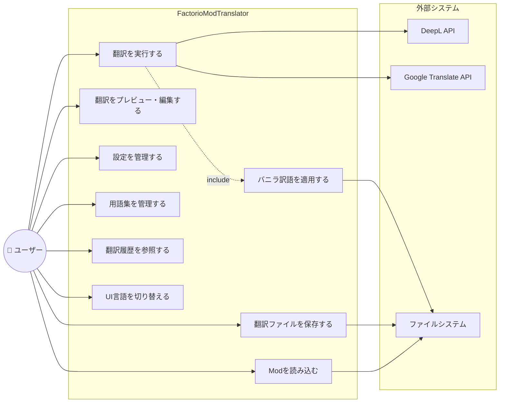
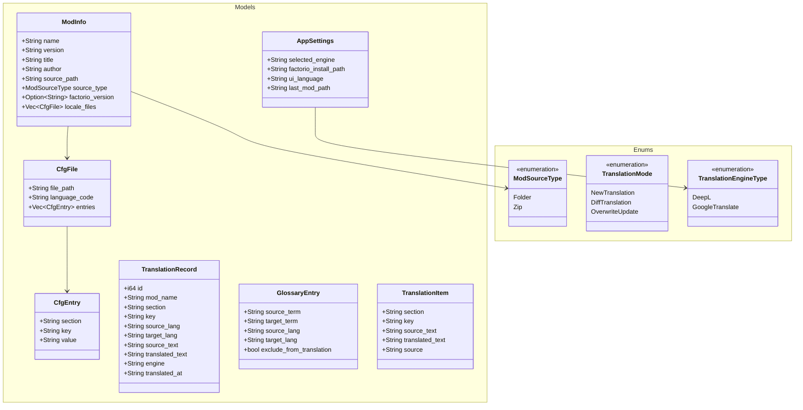
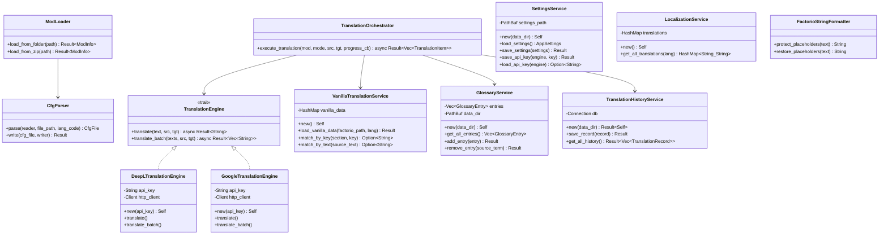
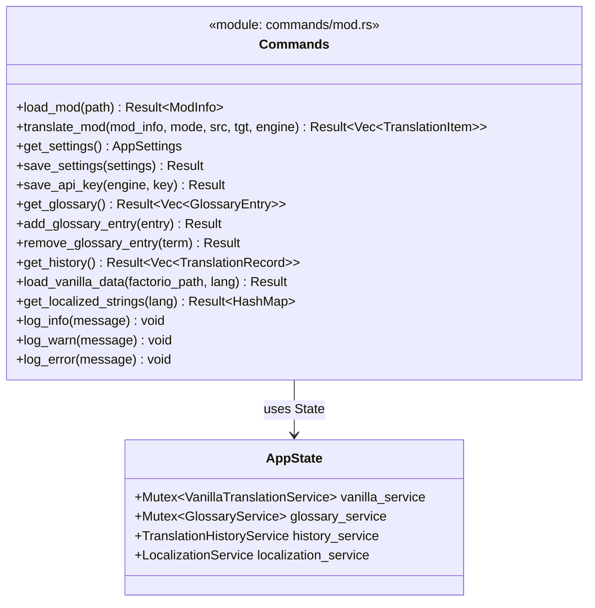
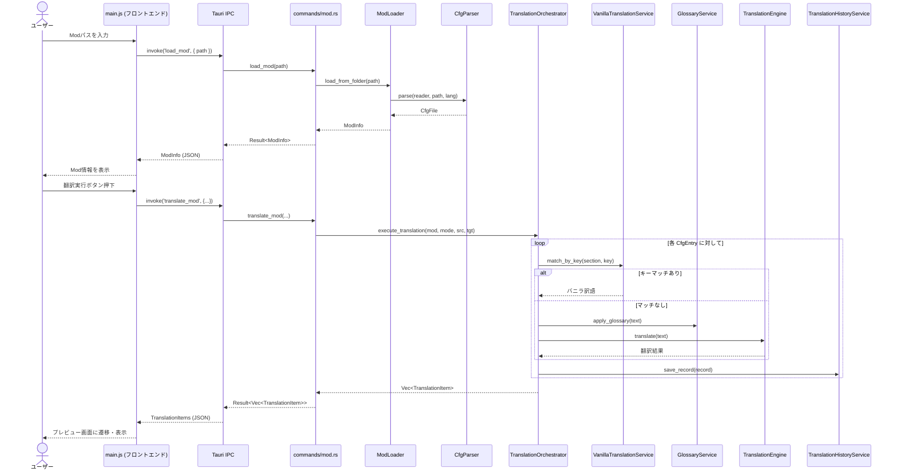
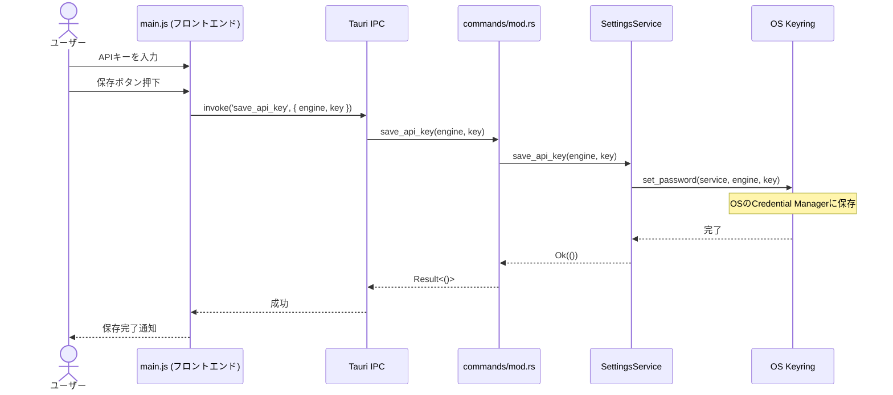
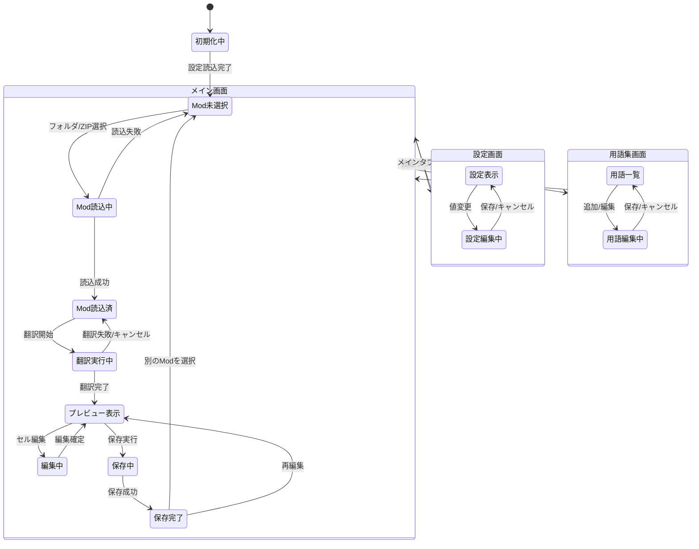
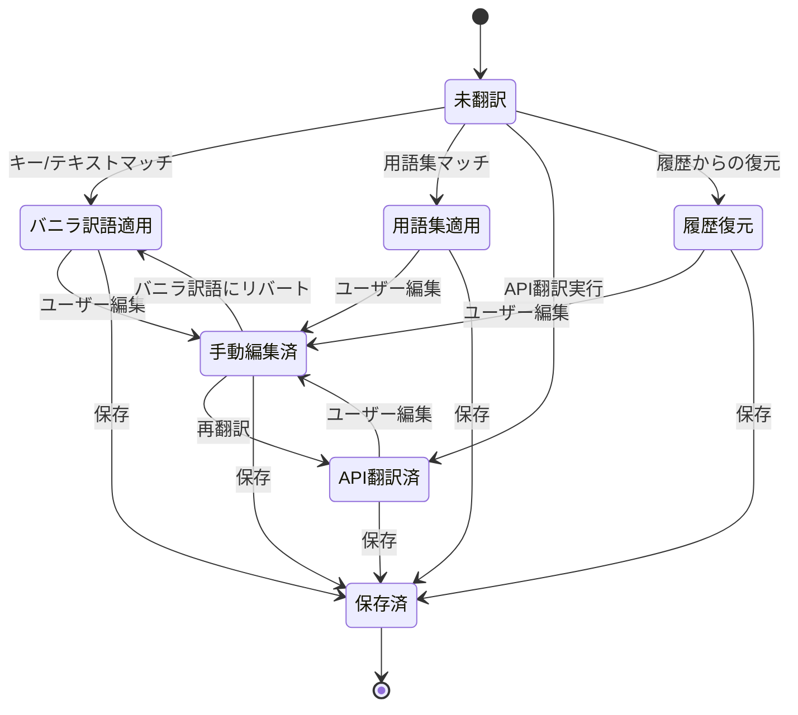
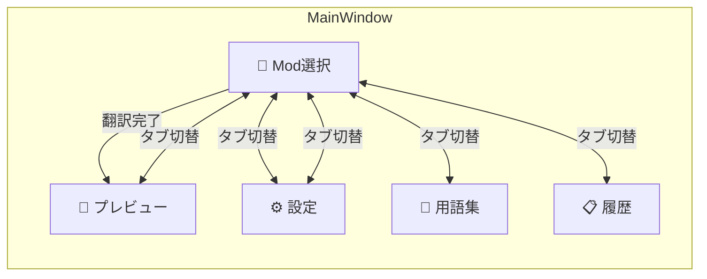
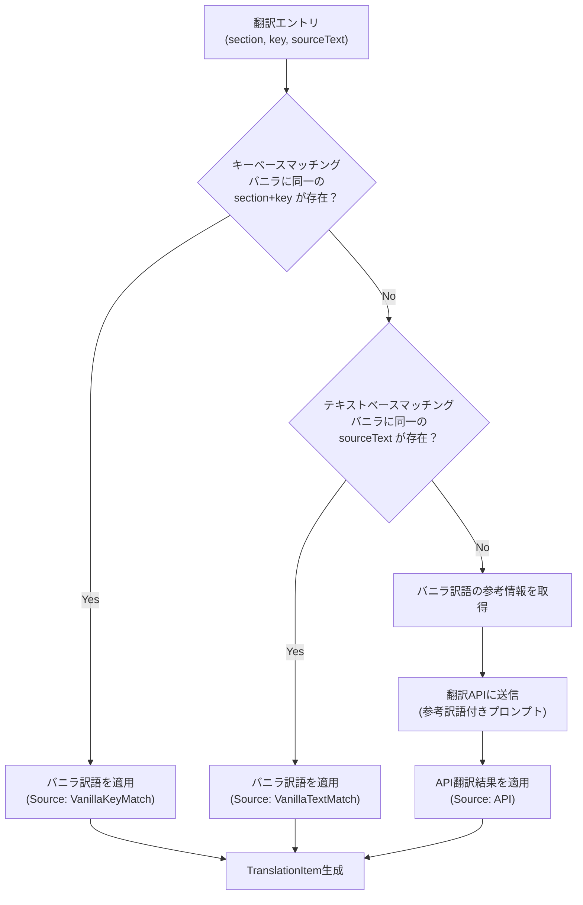

# FactorioModTranslator (Tauri版) 設計資料

## 1. システム概要

Factorio 2.x (Space Age) 対応Modの翻訳ファイル(.cfg)を自動翻訳・管理するWindows GUIアプリケーション。
WPF版からの技術移行により、Rust + Web技術ベースのクロスプラットフォーム対応アーキテクチャへ刷新。

| 項目 | 内容 |
|---|---|
| アプリ名 | FactorioModTranslator |
| 対象OS | Windows 10/11 |
| フレームワーク | Tauri 2.x (Rust + WebView2) |
| フロントエンド | Vanilla JavaScript / HTML / CSS |
| バックエンド | Rust |
| アーキテクチャ | Command/IPC (フロントエンド → Rust バックエンド) |
| 翻訳エンジン | DeepL API / Google Translate API |
| データ永続化 | SQLite (履歴) / JSON (設定・用語集) |
| APIキー管理 | OS Keyring (keyring crate) |
| ログ出力 | tauri-plugin-log (`%LOCALAPPDATA%\FactorioModTranslator\logs`) |
| 配布形態 | NSIS インストーラ (.exe) |
| ライセンス | MIT |

### WPF版との主な差異

| 項目 | WPF版 | Tauri版 |
|---|---|---|
| UI技術 | XAML / WPF | HTML / CSS / JavaScript |
| ロジック言語 | C# (.NET 8) | Rust |
| アーキテクチャ | MVVM | Command/IPC |
| APIキー保存 | DPAPI暗号化 | OS Keyring (keyring crate) |
| 実行ファイルサイズ | ~65MB (self-contained) | ~3.5MB (NSIS) |
| ランタイム依存 | .NET 8 (内包) | WebView2 (Windows標準) |

---

## 2. ユースケース図



### ユースケース一覧

| ID | ユースケース | 概要 | アクター |
|---|---|---|---|
| UC1 | Modを読み込む | ローカルフォルダまたはZIPファイルからModを読み込み、locale内のcfgファイルを解析 | ユーザー |
| UC2 | 翻訳を実行する | 選択した翻訳モード（新規/差分/上書き）で翻訳APIを呼び出し | ユーザー, 翻訳API |
| UC3 | 翻訳をプレビュー・編集する | 翻訳結果を表示し、手動で修正可能 | ユーザー |
| UC4 | 翻訳ファイルを保存する | cfgファイルとしてlocale構造でエクスポート | ユーザー |
| UC5 | 設定を管理する | APIキー、翻訳エンジン選択、Factorioパスを設定 | ユーザー |
| UC6 | 用語集を管理する | 固有名詞と固定訳の登録・編集・削除 | ユーザー |
| UC7 | 翻訳履歴を参照する | 過去の翻訳結果の閲覧、差分更新への再利用 | ユーザー |
| UC8 | バニラ訳語を適用する | Factorio公式訳語とマッチングし適用 | (UC2から呼出) |
| UC9 | UI言語を切り替える | 日本語/英語の表示切替 | ユーザー |

### ユースケース記述

#### UC1: Modを読み込む

| 項目 | 内容 |
|---|---|
| ユースケースID | UC1 |
| ユースケース名 | Modを読み込む |
| アクター | ユーザー |
| 概要 | ローカルフォルダまたはZIPファイルからModを読み込み、locale内のcfgファイルを解析してアプリ内に取り込む |
| 事前条件 | アプリケーションが起動済みであること |
| 事後条件 | Modの情報（名前、バージョン等）とlocaleファイルの内容が画面に表示され、翻訳対象として選択可能な状態になる |
| トリガー | ユーザーがフォルダ選択ボタンまたはZIPファイル選択ボタンを押下する |

**基本フロー:**

| # | アクター | システム |
|---|---|---|
| 1 | フォルダ選択ボタンまたはZIPファイル選択ボタンを押下する | |
| 2 | | パス入力ダイアログを表示する |
| 3 | フォルダまたはZIPファイルのパスを入力する | |
| 4 | | JS側から `invoke('load_mod', { path })` でRustバックエンドを呼び出す |
| 5 | | ModLoader がModの `info.json` を解析し、Mod名・バージョン・著者等の情報を取得する |
| 6 | | locale ディレクトリ配下の `.cfg` ファイルを収集する |
| 7 | | CfgParser が各 `.cfg` ファイルを解析し、セクション・キー・値を抽出する |
| 8 | | ModInfo構造体をJSON化しフロントエンドに返却、画面に表示する |

**代替フロー:**

| # | 条件 | 処理 |
|---|---|---|
| 5a | `info.json` が存在しないまたは不正 | Err文字列を返却し、フロントエンドがエラーメッセージを表示 |
| 6a | locale ディレクトリが存在しない | Err文字列を返却し、フロントエンドがエラーメッセージを表示 |
| 7a | `.cfg` ファイルの解析に失敗 | 解析可能なファイルのみ読み込みを継続する |
| 3a | ZIPファイルが破損または展開不可 | Err文字列を返却し、フロントエンドがエラーメッセージを表示 |

---

#### UC2: 翻訳を実行する

| 項目 | 内容 |
|---|---|
| ユースケースID | UC2 |
| ユースケース名 | 翻訳を実行する |
| アクター | ユーザー, 翻訳API (DeepL / Google Translate) |
| 概要 | 選択した翻訳モード（新規/差分/上書き）で翻訳エンジンを呼び出し、Modの翻訳を実行する |
| 事前条件 | UC1 でModが読み込まれていること。設定画面で翻訳エンジンのAPIキーが登録済みであること |
| 事後条件 | 翻訳結果がTranslationItemのVecとしてプレビュー画面に表示され、各エントリの翻訳ソースが記録されていること。翻訳履歴がSQLiteに保存されていること |
| トリガー | ユーザーが翻訳モード・ソース言語・ターゲット言語を選択し、翻訳実行ボタンを押下する |
| インクルード | UC8（バニラ訳語を適用する） |

**基本フロー:**

| # | アクター | システム |
|---|---|---|
| 1 | 翻訳モード（新規/差分/上書き）を選択する | |
| 2 | ソース言語とターゲット言語を選択する | |
| 3 | 翻訳実行ボタンを押下する | |
| 4 | | JS側から `invoke('translate_mod', {...})` でRustバックエンドを呼び出す |
| 5 | | TranslationOrchestrator が翻訳モードに応じた対象エントリを決定する |
| 6 | | 各エントリに対して以下の優先順で翻訳を試みる: |
| 6a | | ① 用語集（GlossaryService）で完全一致をチェック |
| 6b | | ② バニラ訳語のキーマッチ（VanillaTranslationService）をチェック【UC8】 |
| 6c | | ③ バニラ訳語のテキストマッチをチェック【UC8】 |
| 6d | | ④ 翻訳履歴（TranslationHistoryService）から過去の翻訳を検索 |
| 6e | | ⑤ 上記すべてマッチしない場合、翻訳APIに送信 |
| 7 | | 翻訳結果をTranslationItemとして生成し、翻訳ソース（Source）を設定する |
| 8 | | 各翻訳結果をSQLite（translation_history）に保存する |
| 9 | | `translation-progress` イベントで進捗をフロントエンドに通知し、完了後プレビュータブに自動遷移する |

**代替フロー:**

| # | 条件 | 処理 |
|---|---|---|
| 4a | APIキーが未設定 | Err文字列「API key not found」を返却し、フロントエンドがエラーメッセージを表示 |
| 6e-a | API呼び出しがタイムアウト | リトライ後、失敗した場合は該当エントリをスキップしエラーログに記録 |
| 6e-b | APIキーが無効 | Err文字列を返却し翻訳を中断する |

---

#### UC3〜UC9

UC3〜UC9のユースケース記述はWPF版と同一の業務フローです。技術的な違いは以下の通り:

- **フロントエンド↔バックエンド間の通信**: WPF版のViewModel直接呼出に代わり、Tauri v2の `invoke()` IPC経由でRustコマンドを呼び出す
- **APIキー保存 (UC5)**: DPAPI暗号化の代わりに `keyring` crateによるOS Keyringを使用
- **UI言語切替 (UC9)**: XAMLリソースの代わりに `locales.json` を使用し、JS側で動的にテキストを差し替える

---

## 3. クラス図

### 3.1 全体構成（モデル層）



### 3.2 サービス層



### 3.3 コマンド層（IPCインターフェース）

WPF版のViewModel層に相当するのが、Tauri版のコマンド層です。
`#[tauri::command]` マクロで定義された関数群が、フロントエンドJSからの `invoke()` 呼び出しを受け付けます。



---

## 4. シーケンス図

### 4.1 Mod読み込み → 翻訳実行フロー



### 4.2 設定画面 - APIキー保存フロー



---

## 5. 状態遷移図

### 5.1 アプリケーション全体の状態遷移



### 5.2 翻訳エントリの状態遷移



---

## 6. データフロー図

```mermaid
flowchart TB
    subgraph Input["入力"]
        ModFolder["Modフォルダ"]
        ModZip["Mod ZIPファイル"]
        FactorioDir["Factorioインストールフォルダ"]
        UserEdit["ユーザー手動入力"]
    end

    subgraph Frontend["フロントエンド (JavaScript)"]
        MainJS["main.js"]
    end

    subgraph Backend["バックエンド (Rust)"]
        Commands["commands/mod.rs"]
        ModLoader["ModLoader\n(Mod読込)"]
        CfgParser["CfgParser\n(cfg解析/生成)"]
        VanillaService["VanillaService\n(バニラ訳語マッチング)"]
        Orchestrator["TranslationOrchestrator\n(翻訳実行制御)"]
        GlossaryService["GlossaryService\n(用語集適用)"]
        Formatter["FactorioStringFormatter\n(プレースホルダー保護)"]
    end

    subgraph ExternalAPI["外部API"]
        DeepL["DeepL API"]
        GoogleAPI["Google Translate API"]
    end

    subgraph Storage["永続化"]
        SQLite["SQLite\n(翻訳履歴)"]
        JSON_Settings["JSON\n(設定)"]
        JSON_Glossary["JSON\n(用語集)"]
        Keyring["OS Keyring\n(APIキー)"]
        LogFile["ログファイル\n(tauri-plugin-log)"]
    end

    subgraph Output["出力"]
        CfgOutput["翻訳済 .cfg ファイル\n(locale/{lang}/*.cfg)"]
    end

    UserEdit --> MainJS
    MainJS -->|invoke()| Commands
    ModFolder --> ModLoader
    ModZip --> ModLoader
    ModLoader --> CfgParser
    FactorioDir --> VanillaService

    Commands --> ModLoader
    Commands --> Orchestrator
    CfgParser --> Orchestrator
    VanillaService --> Orchestrator
    GlossaryService --> Orchestrator
    JSON_Glossary --> GlossaryService

    Orchestrator --> Formatter
    Formatter --> DeepL
    Formatter --> GoogleAPI
    DeepL --> Orchestrator
    GoogleAPI --> Orchestrator

    Orchestrator --> SQLite
    Orchestrator --> CfgParser
    CfgParser --> CfgOutput

    JSON_Settings --> Commands
    Keyring --> Commands
    Commands --> LogFile
```

---

## 7. 画面構成

### 7.1 画面一覧

| 画面 | 概要 | 主要操作 |
|---|---|---|
| メインウィンドウ | タブナビゲーションベースの全体レイアウト | タブ切替、言語切替 |
| Mod選択タブ | Modの読込と翻訳実行 | パス入力、翻訳実行 |
| プレビュータブ | 翻訳結果の確認・編集 | セル編集、保存 |
| 設定タブ | APIキーやパス等の設定 | APIキー入力、エンジン選択 |
| 用語集タブ | 用語の登録・管理 | 追加、削除 |
| 履歴タブ | 翻訳履歴の参照 | 一覧表示 |

### 7.2 画面遷移図



---

## 8. データ定義

### 8.1 .cfg ファイルフォーマット

```ini
; コメント行
[section-name]
key1=Value text
key2=Another value with __1__ placeholders
key3=Multi-word value

[another-section]
key-a=Some text
```

**解析ルール:**
- `;` で始まる行はコメント
- `[xxx]` はセクションヘッダー
- `key=value` は翻訳エントリ（`=` の左がキー、右が値）
- `__1__`, `__2__` はプレースホルダー（翻訳時に保持必須）
- 空行はそのまま保持

### 8.2 SQLite テーブル定義

```sql
CREATE TABLE translation_history (
    id              INTEGER PRIMARY KEY AUTOINCREMENT,
    mod_name        TEXT NOT NULL,
    mod_version     TEXT,
    section         TEXT NOT NULL,
    key             TEXT NOT NULL,
    source_lang     TEXT NOT NULL,
    target_lang     TEXT NOT NULL,
    source_text     TEXT NOT NULL,
    translated_text TEXT NOT NULL,
    engine          TEXT NOT NULL,
    translated_at   TEXT NOT NULL DEFAULT (datetime('now')),
    UNIQUE(mod_name, section, key, target_lang)
);

CREATE INDEX idx_history_mod ON translation_history(mod_name);
CREATE INDEX idx_history_key ON translation_history(section, key);
```

### 8.3 設定ファイル (appsettings.json)

```json
{
  "selected_engine": "DeepL",
  "factorio_install_path": "C:\\Program Files\\Factorio",
  "ui_language": "ja",
  "last_mod_path": ""
}
```

### 8.4 用語集ファイル (glossary.json)

```json
[
  {
    "source_term": "iron plate",
    "target_term": "鉄板",
    "source_lang": "en",
    "target_lang": "ja",
    "exclude_from_translation": false
  }
]
```

### 8.5 ローカライズファイル (locales.json)

```json
{
  "ja": {
    "AppTitle": "Factorio Mod Translator",
    "SelectMod": "Mod選択",
    "Translate": "翻訳",
    "Glossary": "用語集",
    "History": "履歴",
    "Settings": "設定"
  },
  "en": {
    "AppTitle": "Factorio Mod Translator",
    "SelectMod": "Select Mod",
    ...
  }
}
```

---

## 9. バニラ訳語マッチング アルゴリズム



### 優先度テーブル

| 優先度 | ソース | 条件 | 上書き可否 |
|---|---|---|---|
| 1 | 用語集 (Glossary) | 完全一致する用語が登録済 | ユーザー編集可 |
| 2 | バニラ (キーマッチ) | section+keyがバニラと一致 | ユーザー編集可 |
| 3 | バニラ (テキストマッチ) | 英語原文がバニラと一致 | ユーザー編集可 |
| 4 | 翻訳履歴 | 過去に同キーの翻訳あり | ユーザー編集可 |
| 5 | 翻訳API | API呼び出し（バニラ参考付き） | ユーザー編集可 |

---

## 10. 翻訳モード別処理

| モード | 対象エントリ | 既存翻訳の扱い | 用途 |
|---|---|---|---|
| 新規翻訳 | ソース言語の全エントリ | 翻訳先localeが無い前提 | Modの初回翻訳 |
| 差分翻訳 | ターゲットに存在しないエントリのみ | 既存翻訳は保持 | Modアップデート後の追加分翻訳 |
| 上書き更新 | ソース言語の全エントリ | 既存翻訳を上書き | 全体の再翻訳 |

---

## 11. エラーハンドリング方針

| カテゴリ | エラー例 | 対処 |
|---|---|---|
| API | APIキー無効、レート制限 | Err文字列でフロントエンドに通知、ステータスバーに表示 |
| ファイル | cfg解析失敗、書込権限なし | 詳細エラーメッセージを返却 |
| ネットワーク | 接続タイムアウト | リトライ、フォールバック |
| データ | SQLite破損 | DB再作成を提案 |
| ログ | 全エラーは `tauri-plugin-log` 経由でファイルに記録 | `%LOCALAPPDATA%\FactorioModTranslator\logs` に保存 |

---

## 12. 非機能要件

| 項目 | 要件 |
|---|---|
| パフォーマンス | 1000エントリの翻訳を5分以内（API応答時間依存） |
| 応答性 | 翻訳中もUIがフリーズしない（async/await + Tauri IPC非同期） |
| セキュリティ | APIキーはOS Keyring (Windows Credential Manager) に保存 |
| 保守性 | Command/Service分離、trait によるインターフェース分離 |
| 拡張性 | 翻訳エンジンの追加が容易（TranslationEngine trait実装追加のみ） |
| i18n | UI文字列はlocales.jsonで管理 |
| 実行ファイルサイズ | ~3.5MB (NSIS インストーラ) |
| ログ | `tauri-plugin-log` によるファイル出力、WPF版と同一フォーマット |

---

## 13. 翻訳フォーマット仕様

Factorioのlocaleファイル（.cfg）には、ゲームエンジンが解釈する特殊なプレースホルダーやリッチテキストタグが含まれます。
これらが翻訳エンジン（DeepL API等）によって変換・破壊されるのを防ぐため、以下のフォーマット保護ロジックを適用します。

### 13.1 保護対象テキスト

| 種別 | フォーマット例 | 備考 |
|---|---|---|
| パラメータ変数 | `__1__`, `__2__` | |
| グローバル変数 | `__ITEM__iron-plate__` | |
| 複数形指定 | `__plural_for_parameter_1_{1=hour\|rest=hours}__` | |
| リッチテキスト | `[item=iron-plate]`, `[color=red]` | |
| 改行記号 | `\n` | 翻訳APIによる空白付与などを防止 |

### 13.2 DeepL API における保護処理フロー

1. **HTMLエンコード**: 翻訳対象テキストを `html_escape::encode_text` でエンコードし、既存の `<` や `>` 記号をエスケープします。
2. **タグのラッピング**: 正規表現 `(__.*?__)|(\[.*?\])|(\\n)` を用いて保護対象テキストを抽出し、`<keep> ... </keep>` で囲みます。
3. **API呼び出し**: DeepL API に `tag_handling = "xml"` および `ignore_tags = ["keep"]` を指定して翻訳リクエストを送信します。
4. **タグのアンラッピング**: APIからの翻訳結果から、すべての `<keep>` および `</keep>` タグを削除します。
5. **HTMLデコード**: エスケープされていた記号を元に戻し、最終的な翻訳結果とします。

---

## 14. ディレクトリ構成

```
factoriomodtranslator_app/
├── src/                          # フロントエンド (HTML/CSS/JS)
│   ├── index.html                # メイン画面
│   ├── index.css                 # デザインシステム (Factorio風テーマ)
│   ├── styles.css                # コンポーネントスタイル
│   ├── main.js                   # アプリロジック (invoke経由でRust呼出)
│   ├── locales.json              # UI文字列リソース (ja/en)
│   └── assets/                   # 静的アセット
├── src-tauri/                    # バックエンド (Rust)
│   ├── Cargo.toml                # Rust依存関係
│   ├── tauri.conf.json           # Tauri設定
│   ├── src/
│   │   ├── main.rs               # エントリーポイント
│   │   ├── lib.rs                # Tauriアプリ初期化・プラグイン設定
│   │   ├── commands/
│   │   │   └── mod.rs            # IPCコマンド定義 (AppState含む)
│   │   ├── models/
│   │   │   ├── mod.rs
│   │   │   ├── cfg.rs            # CfgEntry, CfgFile
│   │   │   ├── enums.rs          # ModSourceType, TranslationMode等
│   │   │   ├── glossary.rs       # GlossaryEntry
│   │   │   ├── mod_info.rs       # ModInfo
│   │   │   ├── settings.rs       # AppSettings
│   │   │   └── translation.rs    # TranslationItem, TranslationRecord
│   │   └── services/
│   │       ├── mod.rs
│   │       ├── cfg_parser.rs     # .cfg解析・生成
│   │       ├── formatter.rs      # プレースホルダー保護
│   │       ├── glossary_service.rs
│   │       ├── localization_service.rs
│   │       ├── mod_loader.rs     # フォルダ/ZIP読込
│   │       ├── orchestrator.rs   # 翻訳実行制御
│   │       ├── settings_service.rs
│   │       ├── translation_engines.rs  # DeepL/Google実装
│   │       ├── translation_history_service.rs
│   │       └── vanilla_translation_service.rs
│   └── icons/                    # アプリアイコン
├── src-wpf/                      # WPF版ソース (参考用に保持)
├── docs/                         # ドキュメント
├── package.json                  # npm依存関係
└── README.md
```
